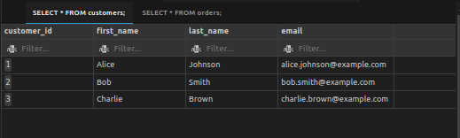

# I.c.5 Practical Exercises with data Manipulation
Alright, it's time to put my data manipulation skills to the test! I'm going to create some tables, populate them with data, and then try out all the `INSERT`, `UPDATE`, and `DELETE` commands I've reviewed.

## Setting Up My Practice Environment
Since this is my first time adding data to my PostgreSQL database (my_first_database), I'll start by creating a few simple tables. Let's create two tables: `customers` and `orders`.

### Accessing PostgreSQL
As defined in the section I.a of my self-study notes, I can connect to the database using the command line interface (CLI). There are two ways to do this:
- From the integrated terminal in VSCode:
```
sudo -i -u postgres
psql
\l
\conninfo
\c my_first_database;
```
- Using the SQLTools extension in VSCode:
	- Click on the database icon representing the SQLTools extension in the VSCode sidebar.
	- Double-click on my saved connection.
This will open a new tab in the VSCode editor, allowing you to execute SQL commands directly.

### Creating the `customers` Table
I'll use the `CREATE TABLE` statement to define the structure of my `customers` table:
```
CREATE TABLE customers (
	customer_id SERIAL PRIMARY KEY,
	first_name VARCHAR(50) NOT NULL,
	last_name VARCHAR(50) NOT NULL,
	email VARCHAR(100) UNIQUE NOT NULL
);
```
Here's what's happening:
- `CREATE TABLE customers`: This tells PostgreSQL I'm making a new table called `customers`.
- The parentheses enclose the column definitions.
- `customer_id SERIAL PRIMARY KEY`:
	- `customer_id` is the column name.
	- `SERIAL` is a PostgreSQL data type that automatically generates unique integer values (perfect for IDs!).
	- `PRIMARY KEY` means this column will uniquely identify each customer.
- `first_name VARCHAR(50) NOT NULL`:
	- `first_name` is another column.
	- `VARCHAR(50)` means it will store text up to 50 characters long.
	- `NOT NULL` means this column must always have a value.
- `last_name VARCHAR(50) NOT NULL`: Similar to `first_name`.
- `email VARCHAR(100) UNIQUE NOT NULL`:
	- `email` stores email addresses (up to 100 characters).
	- `UNIQUE` means each customer must have a different email.
	- Again, it's `NOT NULL` because it's required information.

#### Result:
```
my_first_database=# CREATE TABLE customers (
my_first_database(# customer_id SERIAL PRIMARY KEY,
my_first_database(# first_name VARCHAR(50) NOT NULL,
my_first_database(# last_name VARCHAR(50) NOT NULL,
my_first_database(# email VARCHAR(100) UNIQUE NOT NULL
my_first_database(# );
CREATE TABLE
my_first_database=# \dt
           List of relations
 Schema |   Name    | Type  |  Owner   
--------+-----------+-------+----------
 public | customers | table | postgres
(1 row)
```
Once the table is created the psql command line interface will prompt a `CREATE TABLE` result. That means the table was created accordingly. Right after, I verified the table creation by typing `\dt` to list all the tables. If I want even more information I can just type `\dt+`, this is an extended version of `\dt` that provides additional information about the tables, such as the schema, name, type, owner, and more.

#### Permissions
I created the first table using psql, but the next one I want to create using the SQLTools extension. When you create tables or other objects in PostgreSQL using the `psql` CLI logged in as the `postgres` superuser, those objects are owned by the `postgres` user by default. Therefore, if you want to access those objects from SQLTools using the `admin` user, you need to explicitly grant privileges to the `admin` user.

Here's the command you can use in the `psql` CLI to grant the `admin` user access to the tables in your database:
```
GRANT ALL PRIVILEGES ON ALL TABLES IN SCHEMA public TO admin;
```
This command will grant the `admin` user all privileges (`SELECT`, `INSERT`, `UPDATE`, `DELETE`, etc.) on all existing tables in the `public` schema, you'll need to replace `public` with the appropriate schema name.

**Tip:** Within the `psql` prompt, type `\! clear` and press Enter to execute the `clear` command from Linux's shell, in order to clear the screen in the terminal window.

### Creating the `orders` Table
Now, let's create the `orders` table:
```
CREATE TABLE orders (
	order_id SERIAL PRIMARY KEY,
	customer_id INTEGER REFERENCES customers(customer_id),
	order_date DATE NOT NULL,
	total_amount NUMERIC(10,2) NOT NULL
);
```
Here's the breakdown:
- `order_id SERIAL PRIMARY KEY`: Same as before, an auto-incrementing ID.
- `customer_id INTEGER REFERENCES customers(customer_id)` :
	- This is the foreign key! It links each order to a specific customer.
	- `INTEGER` matches the data type of `customer_id` in the `customers` table.
	- `REFERENCES customers(customer_id)` establishes the relationship. It says, "This value must be a valid `customer_id` that exists in the `customers` table."
- `order_date DATE NOT NULL`: Stores the date of the order.
- `total_amount NUMERIC(10,2) NOT NULL`: Stores the total order amount, allowing for up to 10 digits (including 2 decimal places).

**Note:** If you decide to run the SQL command to create the table from SQLTools extension, make sure to click on the "play button" followed by the "Run on active connection" text to execute it.

**NB:** You'll need to click on the "refresh" (🔄) icon within the SQLTools extension to see the new table in the list.

### Populating the `customers` Table with Data
Now that I have my tables set up, it's time to add some customers! I'll use the `INSERT INTO` statement to insert multiple rows at once:
```
INSERT INTO customers (first_name, last_name, email)
VALUES
	('Alice', 'Johnson', 'alice.johnson@example.com'),
	('Bob', 'Smith', 'bob.smith@example.com'),
	('Charlie', 'Brown', 'charlie.brown@example.com');
```
**Hold on!**  When I tried to run this in the SQLTools extension, I got a "permission denied" error. It turns out that since I created the `customers` table as the `postgres` user, I need to grante the `admin` user (who I'm using in SQLTools) permission to use the sequence that generates the `customer_id` values.
```
GRANT ALL PRIVILEGES ON ALL TABLES IN SCHEMA public TO admin;
GRANT ALL PRIVILEGES ON ALL SEQUENCES IN SCHEMA public TO admin;
```
#### Result:
```
sql-review-course$ sudo -i -u postgres
[sudo] password for eliu: 
postgres@eliu-Latitude-3490:~$ psql
psql (14.12 (Ubuntu 14.12-0ubuntu0.22.04.1))
Type "help" for help.

postgres=# \c my_first_database
You are now connected to database "my_first_database" as user "postgres".
my_first_database=# GRANT ALL PRIVILEGES ON ALL TABLES IN SCHEMA public TO admin;
GRANT
my_first_database=# GRANT ALL PRIVILEGES ON ALL SEQUENCES IN SCHEMA Public TO admin;
GRANT
```
After granting these permissions in the `psql` CLI, everything worked smoothly!
**Interview-Ready Explanation:**
I used `INSERT INTO` to add three new customers to the `customers` table, providing values for their first name, last name, and email. If you run into permission issues, make sure to grant the necessary privileges on tables and sequences to the user you're connecting with.

### Populating the `orders` Table with Data
Next, I'll add some order for these customers:
```
INSERT INTO orders (customer_id, order_date, total_amount)
VALUES
	(1, '2024-01-15', 125.50), -- Alice
	(2, '2024-02-22', 89.99),  -- Bob
	(1, '2024-03-10', 210.85); -- Alice again
```
**Interview-Ready Explanation:**
I'm inserting three orders into the `orders` table, associating each order with a customer ID from the `customers` table, and providing the order date and total amount.

### Verifying the Data
Let's make sure everything got inserted correctly. I'll use a `SELECT` statement to view the data in both tables:
```
SELECT * FROM customers;
SELECT * FROM orders;
```
This should display the data I just inserted.

The following screenshot is an example of how the results will be displayed in the SQLTools extension when you run it. You have to click the tabs to switch between different results.



**Interview-Ready Explanation:**
I'm using `SELECT *` to retrieve all columns and rows from the `customers` and `orders` tables to verify that the data I inserted is present and correct.

Now that I have some data to work with, I'm ready to move on to the next exercise, where I'll practice updating and deleting data.

