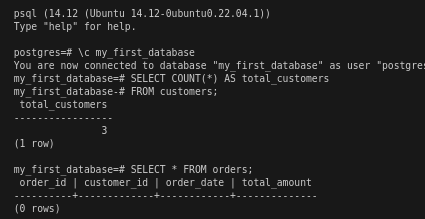

# I.d Aggregate Functions and Grouping (GROUP BY, HAVING)
Now that I've mastered the basics of adding, modifying, and removing data, it's time to level up my analysis skills. Aggregate functions and grouping are powerful tools that let me summarize and aggregate data from my tables to gain valuable insights.

## 1. Functions like `COUNT`, `SUM`, `AVG`, `MIN`, `MAX`
Aggregate functions perform calculations on a set of values and return a single result. They're like built-in calculators for your database! Here are some common aggregate functions:
- `COUNT()`: Counts the number of rows or non-null values in a column.
- `SUM()`: Calculates the total sum of values in a column.
- `AVG()`: Calculates the average (mean) of values in a column.
- `MIN()`: Finds the smallest value in a column.

### Example:
Let's find out how manu customers I have and the total amount spent on all orders:
```
-- Count the number of customers
SELECT COUNT(*) AS total_customers
FROM customers;

-- Calculate the total amount spent on all orders
SELECT SUM(total_amount) AS total_spent
FROM orders;
```
When I ran the queries above, I got 3 total_customers, but 0 rows in the second query. This is because in the previous section we executed a `DELETE`statement that removed all orders.


#### Interview-Ready Explanation:
Aggregate functions like `COUNT`, `SUM`, `AVG`, `MIN`, and `MAX` allow you to perform calculations on a set of values within a table, returning a single summarized result.

### Adding more data
Right now I want to add some more rows in both tables, so we can keep some data to be used in the next section.

Let's do it by running the following:
```
INSERT INTO customers (first_name, last_name, email)
VALUES
    ('David', 'Lee', 'david.lee@example.com'),
    ('Eva', 'Garcia', 'eva.garcia@example.com');

INSERT INTO orders (customer_id, order_date, total_amount)
VALUES
    (1, '2024-04-20', 75.25), -- Alice
    (4, '2024-05-05', 150.00), -- David
    (3, '2024-06-12', 95.80),  -- Charlie
    (5, '2024-07-03', 235.10); -- Eva
```

And check the results with some `SELECT`s:
Let's do it by running the followin:
```
SELECT * FROM customers;
SELECT * FROM orders;
```

